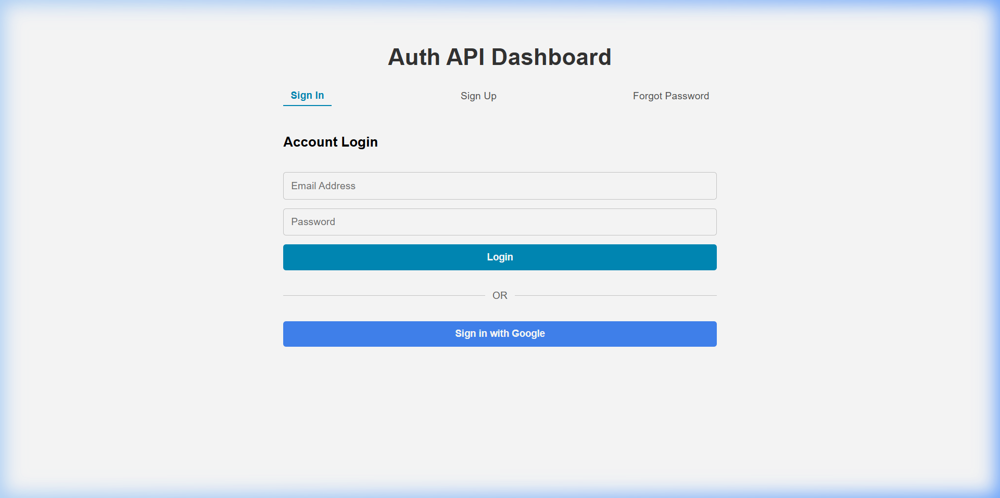
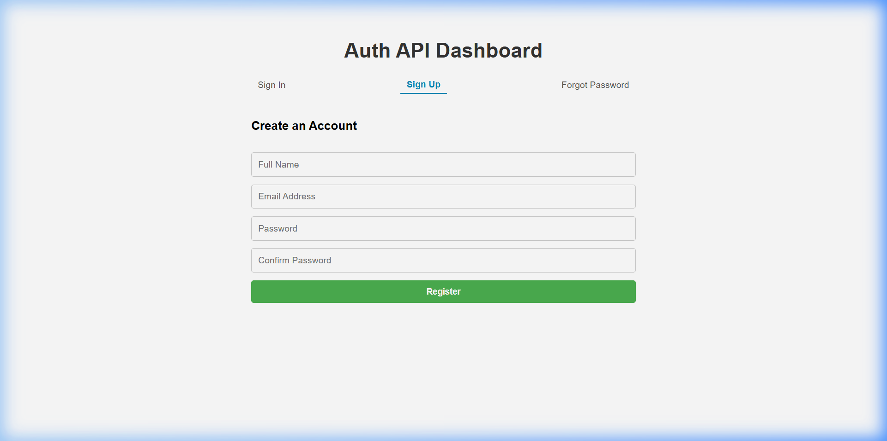
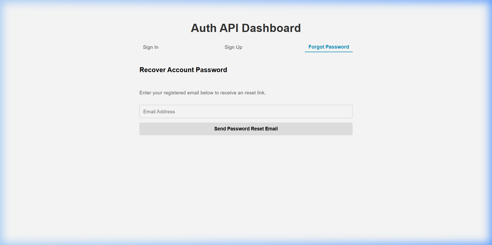

# SecureAuth

A full-stack authentication system built with Node.js, Express, MongoDB, and React.

🔗 **Live App:** https://secureauth-fullstack.vercel.app  
🔗 **API:** https://secureauth-8aq1.onrender.com

---

## Screenshots

<table>
  <tr>
    <td></td>
    <td></td>
    <td></td>
  </tr>
  <tr>
    <td align="center">Login</td>
    <td align="center">Register</td>
    <td align="center">Forgot Password</td>
  </tr>
</table>

---

## Features

- Email/password registration with email verification
- JWT access + refresh token rotation
- Google OAuth2 login (Passport.js)
- TOTP-based two-factor authentication (setup, enable, disable)
- Password reset via email
- Role-based access control (user / admin)
- Admin: list users, view logs, unlock accounts, change roles, delete users
- Login activity logging
- Account lockout after 5 failed attempts (15 min)
- Rate limiting, Helmet security headers, Mongo sanitization, Joi validation

---

## Tech Stack

**Backend:** Node.js, Express 5, MongoDB, Mongoose, Passport.js, JWT, bcryptjs, otplib, Joi, Helmet, Brevo (email), EJS, Swagger  
**Frontend:** React (custom hooks: `useAuth`, `useTwoFactor`, `useAdmin`)  
**Deployed on:** Vercel (frontend) + Render (backend) + MongoDB Atlas

---

## Project Structure

```
AuthAPI/
├── Backend/
│   ├── config/         # Passport OAuth strategy
│   ├── controllers/    # Route handlers
│   ├── middleware/     # Auth, RBAC, rate limiting, validation
│   ├── models/         # Mongoose schemas
│   ├── routes/         # Express routers
│   ├── services/       # Business logic (auth, mail, token, 2FA, activity)
│   ├── utils/          # AppError class
│   ├── views/emails/   # EJS email templates
│   └── server.js
└── Frontend/
    └── api-frontend/
        └── src/
            ├── components/
            ├── hooks/
            └── App.jsx
```

---

## API Endpoints

### `/api/auth`
| Method | Route | Description |
|---|---|---|
| POST | `/register` | Register new user |
| POST | `/login` | Login |
| POST | `/logout` | Logout |
| GET | `/verify-email` | Verify email |
| GET | `/google` | Google OAuth login |
| POST | `/2fa/setup` | Setup 2FA *(auth required)* |
| POST | `/2fa/enable` | Enable 2FA *(auth required)* |
| POST | `/2fa/disable` | Disable 2FA *(auth required)* |
| POST | `/2fa/verify-login` | Verify 2FA code at login |

### `/api/users`
| Method | Route | Description |
|---|---|---|
| GET | `/` | List all users *(admin)* |
| GET | `/logs` | Activity logs *(admin)* |
| GET | `/:id` | Get user *(auth required)* |
| PUT | `/profile` | Update profile *(auth required)* |
| PUT | `/:id/role` | Change role *(admin)* |
| DELETE | `/:id` | Delete user *(admin)* |
| POST | `/:id/unlock` | Unlock account *(admin)* |
| POST | `/forgot-password` | Request password reset |
| POST | `/reset-password/:token` | Reset password |
| POST | `/refresh` | Refresh access token |

---

## Environment Variables

```dotenv
PORT=5000
CLIENT_URL=https://secureauth-fullstack.vercel.app
MONGO_URI=your_mongodb_connection_string

JWT_ACCESS_SECRET=your_secret
JWT_REFRESH_SECRET=your_secret

GOOGLE_CLIENT_ID=your_google_client_id
GOOGLE_CLIENT_SECRET=your_google_client_secret
GOOGLE_CALLBACK_URL=https://secureauth-8aq1.onrender.com/api/auth/google/callback

BREVO_API_KEY=your_brevo_api_key
EMAIL_USER=your_verified_sender_email
```

> **Note:** Render blocks SMTP ports on free tier. Brevo's HTTP API is used instead.

---

## Local Setup

```bash
# Backend
cd Backend
npm install
npm run dev        # http://localhost:5000

# Frontend
cd Frontend/api-frontend
npm install
npm start          # http://localhost:3000
```

---

## Deployment Notes

1. `CLIENT_URL` must match the frontend origin exactly (no trailing slash) — otherwise CORS fails.
2. Use `app.set("trust proxy", 1)` not `true` on Render — avoids rate-limiter crash.
3. Don't `await` email sends — wrap in `try/catch` so email failure never breaks the request.
4. Render blocks SMTP (25/465/587) on free tier — use an HTTP email API instead.
5. Brevo: new server IPs are blocked by default — authorize the IP or disable IP restriction.
6. Google OAuth: `GOOGLE_CALLBACK_URL` must exactly match the redirect URI in Google Cloud Console.
